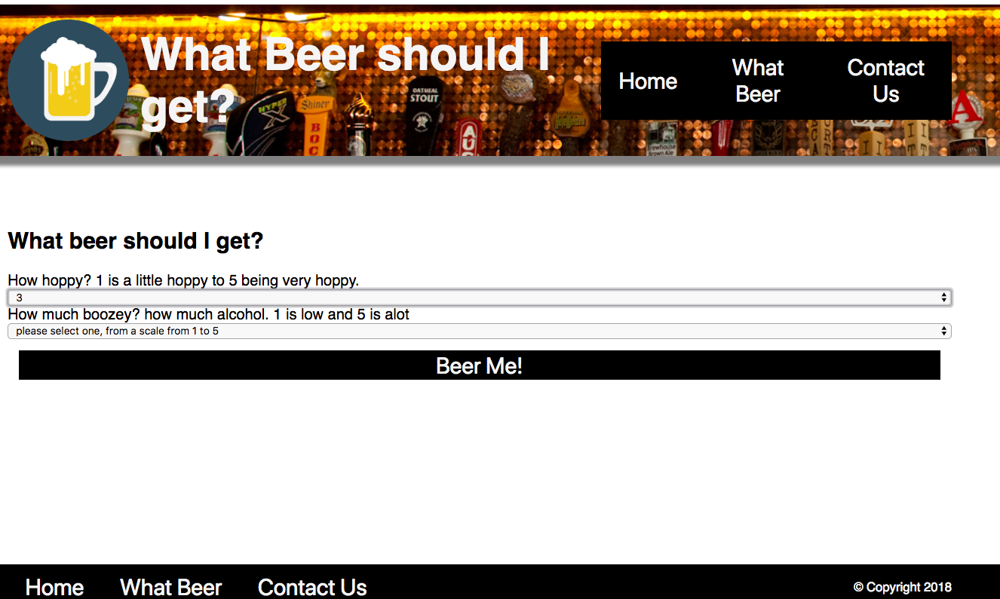
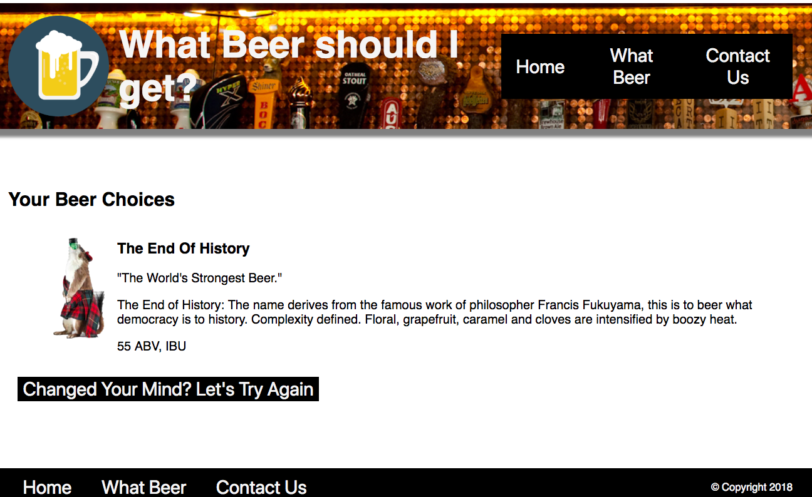

# What Beer should I get?
### Have you asked your self this question? If you have ever had a rough time on deciding what kind of beer to get when you are at the Liquor store, a restaurant, or at a bar. You are in the right place! Here you can search for beer based on how hoppy or strong you want your beer to be. I'll you have to do is pick how hoppy or strong from a list from 1-5 and "What Beer Do I Want?" will make a list for you. Just remember, the more extreme you make your selections, the less you will have to choose from. What beer pulls the beer list information from the [Punk API] (https://punkapi.com/documentation/v2). What Beer filters this list depending on the user's inputs. 

##What Beer is [deployed here](https://whattohave-a959e.firebaseapp.com/)

# Want to improve What Beer should I get?
#### To install What Beer locally just:

* fork the repository
* clone or Download
* npm install  
* npm start

## MIT LICENSE 
### Copyright (C) 2018 Oil Change

## TERMS AND CONDITIONS FOR COPYING, DISTRIBUTION AND MODIFICATION

* If you use this just credit me and if you make a lot of money, share the wealth!

## Oil Change was created by Derek Hassick, you can contact me directly at derek.hassick@gmail.com or on [linkedIn](www.linkedin.com/in/derek-hassick).
